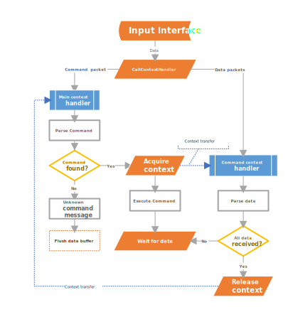

Introducing **Simple Command Line Interface** (CLI) library. It was designed for use in microcontrollers that have different input/output interfaces like UART, SPI, UART over BLE and etc. Using this library gives an opportunity to control devices via sending commands to datalines. Commands will be interpreted and executed performing user programmed operations.

#### Essential Features
1.	Easy command and attributes creation
2.	Command line messages parser
3.	Multi-layer context switching capability
4.	Architecture-free design

## Easy CLI commands creation
One of the goals was to make the process of command and attributes creation more structured using clear visible code with attributes parser automation. Unlike different CLI implementations command attributes are defined in special structure that allows easy adding and parsing new commands and more attributes.

## Command line messages parser
While creating new commands user have a choice to process attribute and values by himself or use `ParseCmdArgs()` method. That automates attribute parsing and assigns arguments values to specific variables inside command function. Everything you need is to add each address of variables to a special list. If the parsing method finds an attribute it stores the value in a variable using preset addresses.
## Multi-layer context switching capability
 The main feature of **Simlpe_CLI** library is context switching capability. Providing that allows to create and use such commands as file_transfer, when after receiving command we pass data flow handling to different method to process and save significant amount of data in non-volatile memory, for example.  Different levels of context handlers can be created. So, after receiving and parsing a command, user context function waits for a sub-command. That sub-command has its own context handler method, and after end of data transfer data flow management functions return back to command context handler methods.
 
## Platform-free design
**Simple_CLI** library includes only standard C libraries. Input/output methods work independently not relying on any specific API of different microcontroller. So, it can be used with various SoCs. User just need to implement and register his own input/output methods that are platform specific.


# Getting started
All necessary methods and structures are defined in simple_cli.h. Creation of command instances in separate .c file is advised. In this case cli_command_set .c and .h files are used 
To get thing work and create own commands follow these steps:
1.	Implement command function 
2.	Implement command context handler (if needed)
3.	Create new command with a list of possible arguments and value types, assigning command and context function
4.	Create instance of Context Manager (``CliContextManager_t``) using ``SIMPLE_CLI_DEF()`` macro
5.	Implement main context handler function and output manager function (if needed)
6.	Initialize Context manager by calling ``InitCLIcontext()`` function
7.	Initialize CLI command set
8.	Make sure that all input data from interface is directed to the ``CallContextHandler()`` function

### Command function

Here is an example what command function code should like:
```C
bool sendfile_cmd(char **argv, cli_command_t* self, CliContextManager_t * _context)
{
    /*1st block*/
    /*default values*/
    uint32_t file_size=1024;
    uint8_t overwrite_flag=0;
    char file_name[32]= "Default";

    /*2nd block*/
    /*Here we MUST initialize  ALL possible command attributes 
    with therefore used addresses of variables*/
    self->args[0].value=&file_size;
    self->args[1].value=&overwrite_flag;
    self->args[2].value=file_name;

    /*3rd block*/
    /*Starting argument parsing*/
	ParseCmdArgs(argv,self);
    
	/*4th block*/
    /*!!! Data flow management transferred to sendfile command context*/		
	AcquireContext(_context,&self->cmd_context)

    /*5th block*/
    /*Simulating file open procedure*/
	SDC_drv_fopen(file_name, 0,file_size);	
	return true;
}
```
Implementation of command function can contain several blocks:
1.	Setting initial (default) values of all function attributes.
2.	Saving addresses of attribute variables in the list. The order should be exact as in cli_command_t object.
3.	Calling ``ParseCmdArgs()`` function. All found values in will the stored in attribute variables
4.	Transfer data flow management calling AcquireContext() function
5.	User defined command code.

### Command context handler
The function receives input data. After end of data handling ``ReleaseContext()`` function must be called.

### Command creation
Example of command:
```C
/* Creating context object*/
Context_t s_f_context;
/*Assigning context handler*/
s_f_context.context_handler=sendfile_context_handler;

cli_command_t sendfile=
{
    .cmd_name = "sendfile",
    .args_num = 3,
    .args = {   {.arg_name="-n", .arg_type=ARG_INT32    }, 				// args[0]
                {.arg_name="-o", .arg_type=ARG_ONLY     }, 				// args[1]
                {.arg_name="-f", .arg_type=ARG_STRING, .value=NULL   }  // args[2]
            },
    .c_func = sendfile_cmd,                     /*Assigning command function*/
    .cmd_info = "Sends file over UART",
    .cmd_ID= 0x01,                              /*Command ID should be unique*/
    .cmd_context = s_f_context					/*Command with context handler*/
};
/*Adding command to a list*/
AddNewCommand(sendfile);
```
### Main context handler
User should implement function that will launch command parsing process. So, it is a top level handler.  
```C
bool MainContextHandler(char *data, size_t length, void * _context)
{
	const char unknown_cmd[]="Command unknown\n";
	int8_t com_res=ProcessCommand(data,(CliContextManager_t*)_context);
	if(!com_res)
    {
        StdOutWrite(unknown_cmd, sizeof(unknown_cmd));
        return false;
    } 						
	return true;
}
```
Another function is optional. It will handle all the data that should be send back as response to a command request. 
```C
uint32_t StdOutWrite(const char* data, size_t length)
{
	/*Example of the code that utilize responce data transmission*/
    for(size_t i=0;i<length;++i)
        printf("%c", data[i]);
	return 0;
}
```
Both above mentioned function must be registered using ``InitCLIcontext()`` function. After that user can send any responce data from command function or contex handlers by calling:
``` C
_context->stdoutFunc("Sample data",strlen("Sample data"));
```
### Data flow routing
**All the incoming data** from input interface must be dispatched using ``CallContextHandler()`` method. According to current settings in ``CliContextManager `` data flow will be transferred to currently active context handler.

### Simple CLI settings
```C
#define USE_STATIC_ALLOCATION   0       /*Use static memory allocation only. Command length will be limited to SIMCLI_MAX_CMD_LEN*/
#define SIMCLI_MAX_CMD_LEN      128     /*Max length of a single command line with arguments*/              			
#define SIMCLI_MAX_COMMANDS     10      /*Max commands number that can be is your system*/
#define SIMCLI_MAX_ARGS         8       /*Max number of arguments in a single command*/
#define CLI_STACK_SIZE          4       /*Max number of CLI context levels*/
#define SIMCLI_ARGS_DELIMITER   " "	    /*Symbols that separate arguments in command line*/
```
## License
Distributed under the MIT License. See [LICENSE](LICENSE.md) for more information.